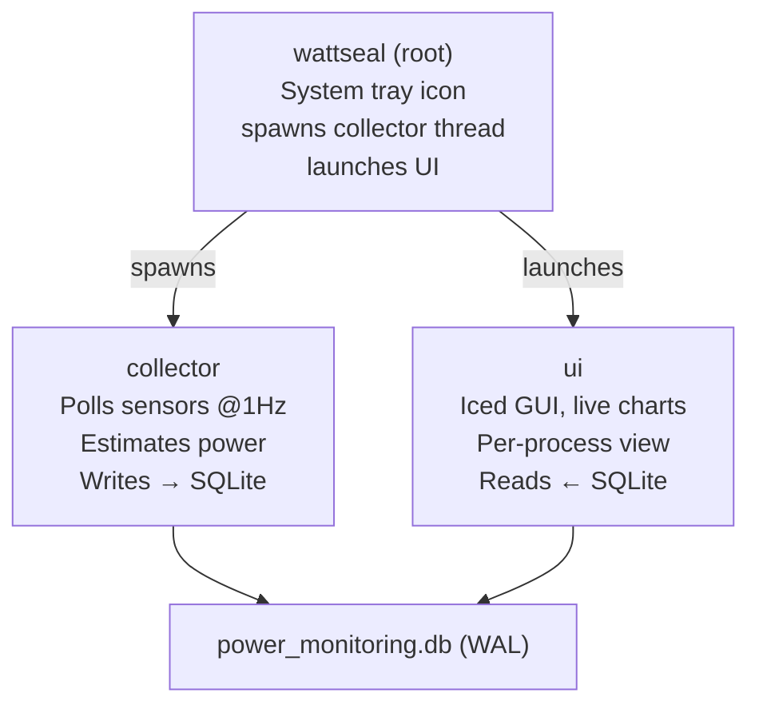

<div align="center">


WattSeal shows you a live breakdown of power consumption of your PC, by component and by app. Monitor which hardware is drawing the most energy, which apps are the biggest energy hogs, and how your usage changes over time.

[](https://github.com/daminoup88/wattseal/releases)
[](https://github.com/daminoup88/wattseal/releases)
[](https://github.com/daminoup88/wattseal/releases)
[](LICENSE)

</div>

---

## Why use WattSeal?

Most people have no idea how much electricity their computer actually uses, or which apps are silently draining power in the background. WattSeal gives you that visibility:

- 🔍 **Live dashboard**: watch power draw update every second
- 🧩 **Per-component breakdown**: CPU, GPU, RAM, storage, network
- 📋 **Per-app breakdown**: find out which processes are costing you the most
- 📈 **Historical charts**: spot trends over time
- 💾 **Local database**: all your data stays on your machine, private

> Power readings are validated against real hardware measurements using a [Shelly Plug Gen3 S](https://www.shelly.com/products/shelly-plug-s-gen3) smart plug.

---

## Getting Started

### Step 1 — Download

Grab the latest release for your operating system from the **[Releases page](https://github.com/daminoup88/wattseal/releases)**:

| Your system | File to download |
|---|---|
| Windows (64-bit) | `WattSeal-windows.exe` |
| Linux (64-bit) | `WattSeal-linux` |
| macOS (Apple Silicon) | `WattSeal-macos` |

WattSeal is a single executable file — no installation needed. Just download it, and you're ready for the next step.

---

### Step 2 — Run it

WattSeal doesn't need administrative privileges to run, but it does need them for precise CPU power measurements. If you skip the admin step, you'll still get power estimates based on CPU usage, but they won't be as accurate.

<details>
<summary><strong>🪟 Windows</strong></summary>

1. Double-click the downloaded `WattSeal-windows-x86_64.exe` file
2. If prompted by Windows Defender SmartScreen, click "More info" and then "Run anyway" to launch the app. This is a standard warning for new apps that haven't yet built up reputation on Windows.
3. If prompted by User Account Control (UAC), and you want the most accurate CPU power readings, click "Yes" to allow it to run with administrator privileges. If you click "No", it will still work but with less precise CPU power estimates.

The app will launch in the system tray in the taskbar and the dashboard will open in a new window. If you close the dashboard, WattSeal will keep running in the background and you can reopen it by clicking the tray icon.

If the app, or more especifically the WinRing0 kernel driver it uses for CPU measurements, is flagged by Windows Defender, it's your responsibility to allow it to run. The app will run without admin privileges, but CPU power readings will be estimates based on usage rather than direct hardware counters. For more info on the security implications of WinRing0, see the [Security](SECURITY.md#winring0-kernel-driver-windows) section of the documentation.

</details>

<details>
<summary><strong>🐧 Linux</strong></summary>

Open a terminal in the folder where you downloaded WattSeal and run:

```bash
chmod +x WattSeal-linux
sudo ./WattSeal-linux
```

> **Note:** the only extra runtime dependency is an X11 system tray library.
> If either `libappindicator` **or** `libayatana-appindicator` is installed
> the app will show a tray icon with menu items; otherwise WattSeal will
> simply run in the background without a tray icon (you can still open the
> dashboard by re‑running the command).

</details>

<details>
<summary><strong>🍎 macOS</strong></summary>

Run the app normally, WattSeal will work without admin privileges.

</details>

---

## What can WattSeal measure?

| Component | How it's measured |
|---|---|
| **CPU (Intel / AMD)** | Direct hardware energy counters (RAPL) — very accurate |
| **GPU (NVIDIA)** | NVML vendor API — very accurate |
| **GPU (AMD, Windows)** | ADLX vendor API — very accurate |
| **GPU (Intel, Windows)** | PDH performance counters |
| **RAM** | Estimated from memory usage |
| **Disk** | Estimated from read/write activity |
| **Network** | Estimated from data throughput |
| **Per-process** | CPU + GPU + I/O breakdown per app |

> **What does "estimated" mean?** For components without built-in energy sensors, WattSeal calculates a best-guess power draw based on how hard the hardware is working and its known power specs. It's less precise than hardware counters, but still gives a solid picture.

---

## Platform Support

With admin privileges, WattSeal provides the most comprehensive power monitoring experience possible on each platform:

|  | Windows | Linux | macOS |
|---|:---:|:---:|:---:|
| Full application | ✅ | ✅ | ✅ |
| CPU energy counters | ✅ | ✅ | Estimated |
| NVIDIA GPU | ✅ | ✅ | ❌ |
| AMD GPU | ✅ | ❌ | ❌ |
| Intel GPU | ✅ | ❌ | ❌ |
| Other sensors (usage, I/O) | ✅ | ✅ | ✅ |
| Auto admin elevation | ✅ UAC | Manual (`sudo`) | Manual |

<details>
<summary><strong>Support without admin privileges</strong></summary>

|  | Windows | Linux | macOS |
|---|:---:|:---:|:---:|
| Full application | ✅ | ✅ | ✅ |
| CPU energy counters | Estimated | Estimated | Estimated |
| NVIDIA GPU | ✅ | ✅ | ❌ |
| AMD GPU | ✅ | ❌ | ❌ |
| Intel GPU | ✅ | ❌ | ❌ |
| Other sensors (usage, I/O) | ✅ | ✅ | ✅ |

</details>

---

<br>

## Troubleshooting

**Rendering issues?** If the UI looks broken or fails to launch, try setting the environment variable `ICED_BACKEND=tiny-skia` before running the app. This forces Iced to use a software renderer which is more compatible with older GPUs and VMs.

# 🛠️ Developer Documentation
<div align="center">

[](https://www.rust-lang.org)
[]()

</div>

The rest of this README is aimed at contributors and developers who want to build WattSeal from source, understand its architecture, or add new features.

> Want to contribute? Check out our [CONTRIBUTING.md](CONTRIBUTING.md) and our [ROADMAP.md](ROADMAP.md) for planned features and areas where help is needed.

---

## Architecture Overview

WattSeal is a Rust workspace made up of three crates:

```
wattseal/               ← Root binary (tray icon, lifecycle management)
  ├── collector/        ← Background sensor polling, power estimation, DB writes
  ├── common/           ← Shared types, SQLite layer, utilities
  └── ui/               ← Iced GUI (dashboard, hardware info, settings, charts)
```

**How the pieces fit together:**



The collector and UI share the same SQLite database file via WAL (Write-Ahead Logging) mode, which allows concurrent reads and writes without locking.

---

## Prerequisites

- **Rust** stable toolchain (version pinned in [`rust-toolchain.toml`](rust-toolchain.toml)).
- On linux, install the build deps for the tray icon, not needed at runtime but required to build the Linux version:

  ```bash
  sudo apt install libgtk-3-dev pkg-config libxkbcommon-dev libwayland-dev
  ```

---

## Building from Source

Clone the repository:
```bash
git clone https://github.com/daminoup88/wattseal.git
```

```bash
cd wattseal
```

Debug build and run:
```bash
cargo run
```

Release build:
```bash
cargo build --release
```

> ⚠️ **Elevated privileges are required** to access hardware energy counters.
> Run with administrator rights on Windows (you will be prompted to elevate), or use `sudo` on Linux.

---

## Project Layout

| Path | What it does |
|---|---|
| `src/main.rs` | Entry point: admin elevation, tray icon, collector thread, UI subprocess |
| `collector/` | All sensor implementations (CPU, GPU, RAM, disk, network, per-process) |
| `common/` | Shared types (`Event`, `SensorData`, …), SQLite database layer, utilities |
| `ui/` | Iced application: pages, components, charts, themes, translations |

---

## Code Style & Quality

The project enforces the formatting and linting rules defined in `rustfmt.toml`. Compliance is checked in CI. You can run the following command locally to ensure your code meets the project's style guidelines before pushing:

```bash
cargo +nightly fmt
```

> The `.vscode/settings.json` is configured to format on save, so if you're using VS Code your code will be formatted automatically when you save a file.

---

# License

WattSeal is licensed under [GPL-3.0](LICENSE). See the [LICENSE](LICENSE) file for details.